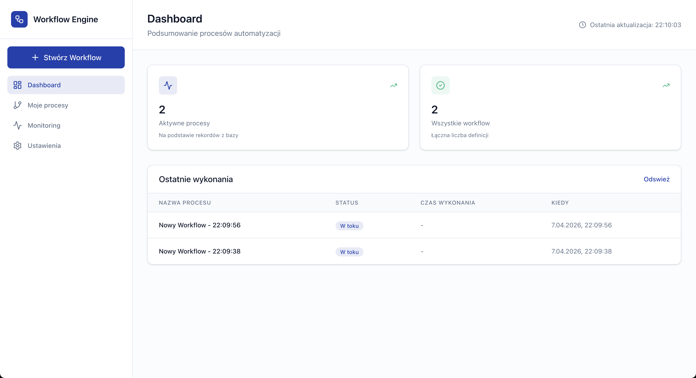
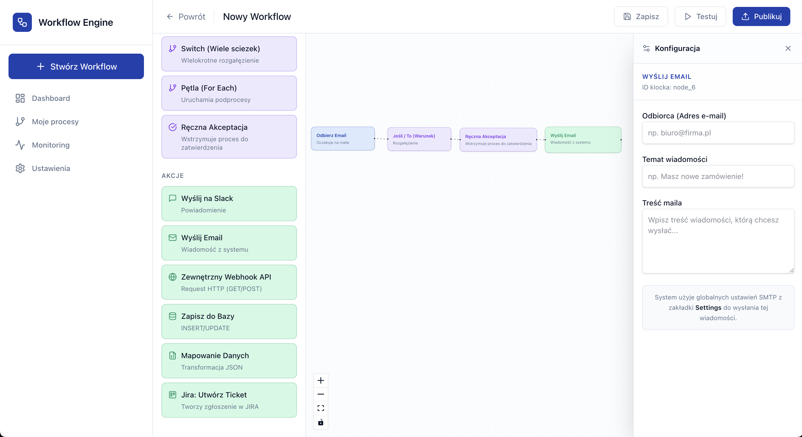
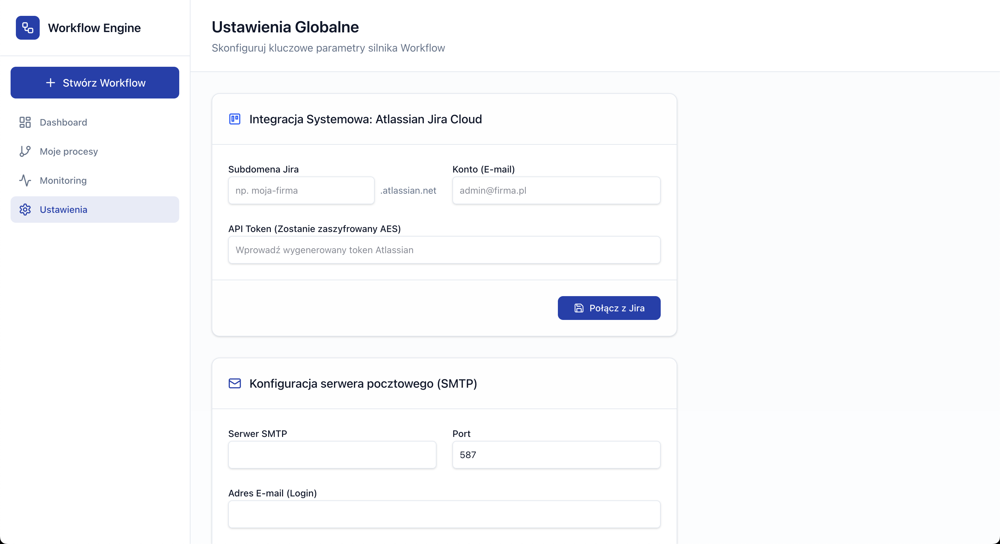

# ⚙️ Workflow Engine

> Autorska, wydajna platforma No-Code / Low-Code do wizualnego budowania i automatyzacji procesów biznesowych, inspirowana systemami takimi jak n8n, Make czy Zapier.

## 📖 O projekcie

**Workflow Engine** to kompleksowy system składający się z asynchronicznego silnika wykonawczego opartego na architekturze DAG (Directed Acyclic Graph) oraz nowoczesnego interfejsu wizualnego. Pozwala nietechnicznym użytkownikom na mapowanie, integrowanie i automatyzowanie przepływu danych pomiędzy różnymi systemami i usługami.

Projekt kładzie duży nacisk na stabilność i standardy "Enterprise", oferując m.in. globalny mechanizm *Retry* z wykładniczym opóźnieniem (Exponential Backoff), asynchroniczne wykonywanie procesów, obsługę pętli (podprocesów) oraz pauzowanie z oczekiwaniem na interwencję człowieka.

---

## ✨ Kluczowe funkcjonalności

* **Wizualny Edytor (Drag & Drop):** Intuicyjny interfejs oparty na React Flow do łączenia wyzwalaczy (Triggers) i akcji (Actions).
* **Asynchroniczny Silnik Wykonawczy:** Zbudowany w Pythonie (FastAPI + SQLAlchemy) zdolny do obsługi wielu równoległych zadań, opóźnień (Delay) oraz harmonogramów (Cron).
* **Human-in-the-loop (Ręczna Akceptacja):** Możliwość trwałego wstrzymania procesu i wznowienia go z poziomu UI (np. wymóg zatwierdzenia ważnego maila przed wysyłką).
* **Dynamiczny Data Mapper:** Bezpośrednie rzutowanie typów i mapowanie zagnieżdżonych struktur JSON przy użyciu dot-notation i tagów zmiennych `{{ }}`.
* **Globalne Bezpieczeństwo:** Scentralizowany moduł szyfrujący (AES) do bezpiecznego przechowywania poświadczeń (API Tokeny, hasła SMTP/IMAP).
* **Zarządzanie Cyklem Życia:** Włączanie, wyłączanie i monitorowanie działających procesów z poziomu dedykowanego Dashboardu.

---

## 📸 Galeria i Działanie (Zrzuty ekranu)

### 1. Panel Zarządzania (Moje Procesy)

*Lista aktywnych i zatrzymanych procesów wraz z przyciskiem szybkiej akceptacji (Human-in-the-loop) i statystykami.*

### 2. Formularze Klocków (No-Code)

*Dynamiczne formularze po prawej stronie edytora. Brak wymogu pisania surowego JSON-a – wszystko wspierane przez UI, w tym pobieranie metadanych (np. projektów Jira) w locie.*

### 3. Globalne Ustawienia (Bezpieczeństwo)

*Scentralizowane miejsce do konfiguracji profili SMTP, IMAP oraz integracji systemowych (Atlassian).*

---

## 🛠️ Dostępne Węzły (Klocki)

Platforma zawiera wbudowaną paletę gotowych narzędzi:

**Wyzwalacze (Triggers):**
* **Webhook:** Odbiera żądania HTTP (GET/POST).
* **Odbierz Email:** Działający w tle IMAP Worker reagujący na nowe wiadomości (z obsługą filtrów).
* **Harmonogram (Cron):** Cykliczne uruchamianie procesów na podstawie interwału lub wyrażeń Cron.

**Bramki Logiczne i Narzędzia:**
* **Jeśli/To (If-Else):** Proste rozgałęzienia na podstawie warunków.
* **Switch:** Wielokrotne ścieżki i warunki, z wbudowanym wyjściem domyślnym (`default`).
* **For Each:** Uruchamianie asynchronicznych podprocesów na podstawie tablic JSON.
* **Opóźnienie Czasowe (Delay):** Usypia proces na określoną liczbę sekund/minut/dni.
* **Ręczna Akceptacja:** Wstrzymuje workflow do momentu kliknięcia zatwierdzenia w UI.
* **Filtruj Dane (JSON Transform):** Odchudzanie payloadów i przepuszczanie tylko wybranych kluczy.

**Akcje (Actions):**
* **Zewnętrzny Webhook API:** Wysyłanie zapytań HTTP z obsługą dynamicznych nagłówków, parametrów URL i różnego formatu Body.
* **Wyślij Email:** Integracja SMTP.
* **Wyślij na Slack:** Powiadomienia na kanały komunikatora.
* **Zapisz do Bazy:** INSERT/UPDATE rekordów w bazie.
* **Jira - Utwórz Ticket:** Pełna integracja z Atlassian REST API (z obsługą Atlassian Document Format).
* **Mapowanie Danych:** Dynamiczne transformacje i rzutowanie typów zmiennych.

---

## 💻 Stos technologiczny

### Backend
* **Język:** Python 3.10+
* **Framework API:** FastAPI
* **Baza danych:** PostgreSQL (Asynchroniczne zapytania za pomocą SQLAlchemy i `asyncpg`)
* **Walidacja:** Pydantic
* **Kryptografia:** `cryptography` (Fernet AES)
* **HTTP Client:** `httpx`

### Frontend
* **Środowisko:** React 18, TypeScript, Vite
* **Silnik Grafowy:** `@xyflow/react` (React Flow)
* **Stylizacja:** Tailwind CSS
* **Ikony:** `lucide-react`